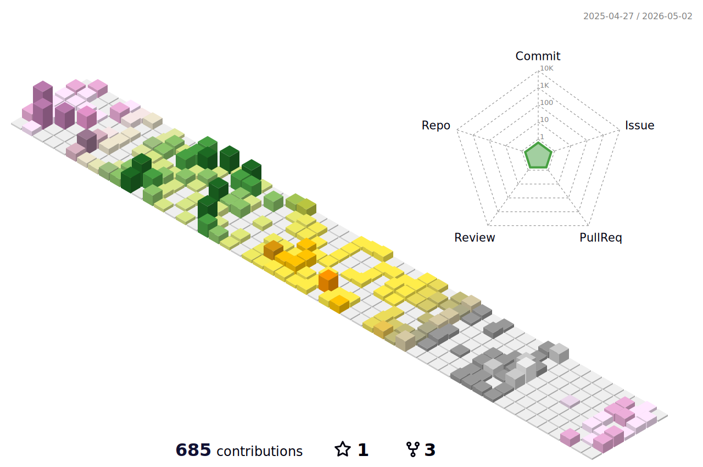

&fontAlignY=40&color=gradient)

  

  

 

<h2>About Me</h2>

I am Danial Bayati and I enjoy coding and reading web development references, and following UX design trends, when I am not coding you can find me designing a website.

In addition, I love programming and design and I try to be better every day than I was yesterday by reading articles and watching educational videos about up-to-date technologies. I also like teamwork and try to code with others and work with them. 🖥

My interest in coding started last year when I was intrigued with how websites were created and also when I discovered that tutorials existed for web development. This led to me following along with various tutorials when I had no idea what HTML or CSS or how they came together in order to form a website.

**Fun Fact**: I like to code in simple and effective ways because consistency and determination are vital.

 

## Github status

