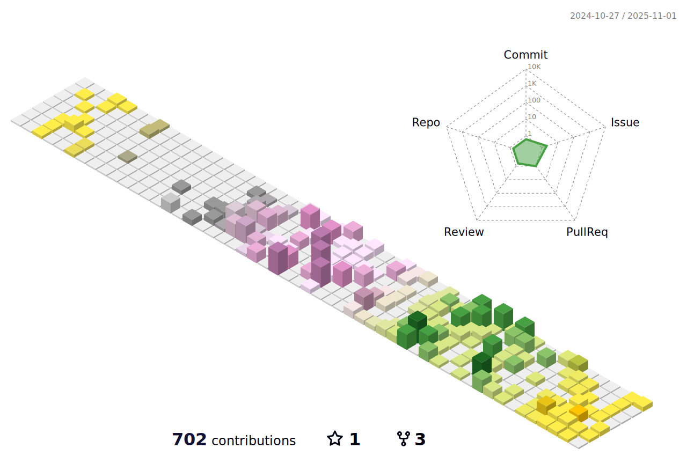

&fontAlignY=40&color=gradient)

  

  

 

<h2>About Me</h2>

I am Danial Bayati (frontend developer) and I enjoy coding and reading web development references, and following UX design trends, when I am not coding you can find me designing a website.

**Fun Fact**: I like to code in simple and effective ways because consistency and determination are vital.

 

## Github status

